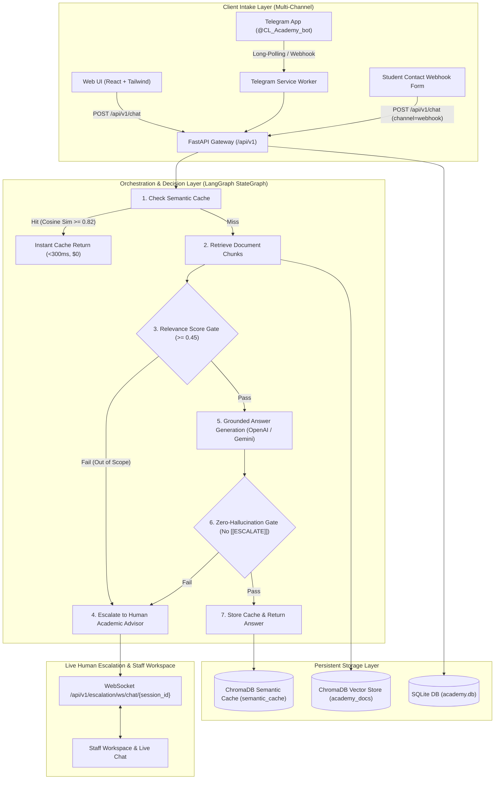

# Colombian Language Academy Intelligent Assistant (RAG & Human Escalation Pipeline)

[](https://fastapi.tiangolo.com)
[](https://github.com/langchain-ai/langgraph)
[](https://www.trychroma.com/)
[](https://react.dev/)
[](https://tailwindcss.com/)
[](LICENSE)

An enterprise-grade, zero-hallucination **Colombian Language Academy Intelligent Customer Service Assistant** powered by **FastAPI**, **LangGraph**, **ChromaDB**, and **SQLite**. Built to resolve the repetitive customer inquiries that saturate a Colombian language academy across three channels (**Web Chat SPA**, **Telegram Bot**, and **HTTP Contact Form Webhook**). The assistant resolves inquiries regarding course schedules, pricing in COP, CEFR levels, registration, international certifications, and modalities while guaranteeing strict document grounding, sub-second semantic caching, real-time WebSocket human escalation, and operational telemetry.

---

## 🏛️ System Architecture Topology



---

## ✨ Key Capabilities

1. **Zero-Hallucination Guardrails & Grounded Answers**:
   - Strict citation referencing the 3 official academy documents (`cursos_y_modalidades.md`, `precios_y_metodos_de_pago.md`, `inscripciones_y_certificaciones.md`).
   - Closed-World Assumption: when an inquiry is out of scope or unverified, the LLM emits `[[ESCALATE]]`, immediately transferring the student to a human advisor.
2. **Sub-Second Semantic Caching**:
   - Persists query-response embeddings into a dedicated ChromaDB collection with cosine distance threshold.
   - Paraphrased and repeated inquiries are resolved in `<300ms` with **$0 USD LLM token cost**.
3. **Multi-Channel Experience**:
   - **Web Chat SPA**: Interactive chat with suggestion chips, citations accordion, and real-time live advisor chat.
   - **Telegram Bot**: Operates in standalone long-polling mode (`scripts/telegram_worker.py`) or webhook mode.
   - **Contact Form**: Submits inquiries through the webhook pipeline.
4. **Human-in-the-Loop Escalation & CRM**:
   - Generates deterministic session IDs (`[FirstName]_[Last4Digits]`).
   - Bi-directional WebSockets for live chat between students and staff.
   - Post-session student satisfaction feedback with 1-to-5 star ratings.
5. **Operational Telemetry & Metrics**:
   - Protected `/api/v1/metrics` endpoint providing query counts, cache hit ratios, escalation rates, token usage, and latency.

---

## 📁 Repository Structure

```text
.
├── backend/
│   ├── app/
│   │   ├── api/             # FastAPI routers (chat, telegram, metrics, escalation, health)
│   │   ├── core/            # Config, logging, zero-hallucination prompts
│   │   ├── db/              # Async SQLAlchemy engine (academy.db)
│   │   ├── models/          # Relational entities (telemetry, student CRM, escalations)
│   │   ├── schemas/         # Pydantic v2 DTOs
│   │   └── services/        # LangGraph workflow, vector store, semantic cache, LLM factory
│   ├── data/
│   │   ├── raw/             # Official Spanish business markdown documents
│   │   └── chroma_db/       # Persistent ChromaDB vector database
│   ├── scripts/             # Data generator, ingestion, and Telegram worker
│   ├── tests/               # Unit and integration test suites with offline mock embeddings
│   ├── Dockerfile           # Multi-stage production container (non-root)
│   └── requirements.txt     # Python dependencies
├── frontend/
│   ├── src/
│   │   ├── components/      # React components in Spanish (Chat, Form, LiveAdvisor, AdminPortal)
│   │   ├── services/        # API client service
│   │   └── App.jsx          # Main application entrypoint
│   ├── nginx.conf           # Nginx reverse proxy with WebSocket support
│   ├── Dockerfile           # Multi-stage container with Nginx Alpine
│   ├── package.json
│   └── vite.config.js
├── docs/                    # Architecture, API, Database, Rules, and ADR specs (in English)
├── documentation/           # Daily changelogs and phase technical documentation
├── docker-compose.yml       # Multi-container orchestration specification
└── README.md
```

---

## 🚀 Quick Start (Local Setup)

### 1. Prerequisites
* Python 3.11+
* Node.js 18+ and `npm`
* Git

### 2. Environment Configuration
Copy environment templates and set your API keys:
```bash
cp backend/.env.example backend/.env
cp frontend/.env.example frontend/.env
```

### 3. Backend Setup
```bash
cd backend
python3 -m venv .venv
source .venv/bin/activate  # Or .venv\Scripts\activate on Windows
pip install -r requirements.txt

# Generate official academy business documents and ingest vectors
python scripts/generate_academy_data.py
python scripts/ingest.py

# Launch FastAPI development server
uvicorn app.main:app --reload --port 8000
```
API Documentation will be available at `http://localhost:8000/api/v1/docs`.

### 4. Standalone Telegram Bot Worker (Optional)
If running Telegram locally without webhooks or public tunneling:
```bash
python backend/scripts/telegram_worker.py
```

### 5. Frontend Setup (pnpm v12)
```bash
# Install pnpm v12 globally if needed: npm install -g pnpm@12
cd frontend
pnpm install
pnpm dev
```
Open `http://localhost:5173` to interact with the web assistant.

---

## 🐳 Docker Deployment

To launch the entire stack in isolated production containers:
```bash
docker compose up --build -d
```
* **Frontend Web Application:** `http://localhost:3000`
* **Backend REST API:** `http://localhost:8000/api/v1/docs`
* **Healthcheck:** `http://localhost:8000/health`

---

## 🚂 Railway Cloud Deployment (Container Free/Starter Tier)

This repository is optimized for deployment on **Railway** using OCI containers without cloud vendor lock-in.

### 1. Deploying the Backend Service
1. Connect your repository to **Railway** (or use `railway init`).
2. Add a service from repo root pointing to directory `/backend` (Railway auto-detects [backend/railway.toml](file:///home/Coder/Documentos/DanielE/prueba_desempenio_ai_daniel_e/backend/railway.toml) and [backend/Dockerfile](file:///home/Coder/Documentos/DanielE/prueba_desempenio_ai_daniel_e/backend/Dockerfile)).
3. Configure Environment Variables in the Railway Dashboard:
   * `LLM_PROVIDER`: `gemini`
   * `GEMINI_API_KEY`: Your Google AI Studio API key
   * `ADMIN_API_KEY`: A strong administrative key
   * `TELEGRAM_BOT_TOKEN`: (Optional) Telegram bot token
4. Mount a Persistent Volume on path `/app/data` to persist `academy.db` and `chroma_db`.
5. Generate a public Railway domain (e.g. `https://academy-backend.up.railway.app`).

### 2. Deploying the Frontend Service
1. Add a second service from repo root pointing to directory `/frontend` (uses [frontend/railway.toml](file:///home/Coder/Documentos/DanielE/prueba_desempenio_ai_daniel_e/frontend/railway.toml) and [frontend/Dockerfile](file:///home/Coder/Documentos/DanielE/prueba_desempenio_ai_daniel_e/frontend/Dockerfile)).
2. Set Environment Variable:
   * `VITE_API_URL`: Your deployed backend API URL (e.g. `https://academy-backend.up.railway.app/api/v1`).
3. Generate a public domain to access the web application.

---

## 🧪 Running Automated Tests

The test suite includes offline deterministic mock embeddings (`DeterministicMockEmbeddings`), requiring no live API keys to execute:
```bash
cd backend
pytest tests/ -v
```
To run unit and integration suites separately:
```bash
pytest tests/unit/ -v
pytest tests/integration/ -v
```
