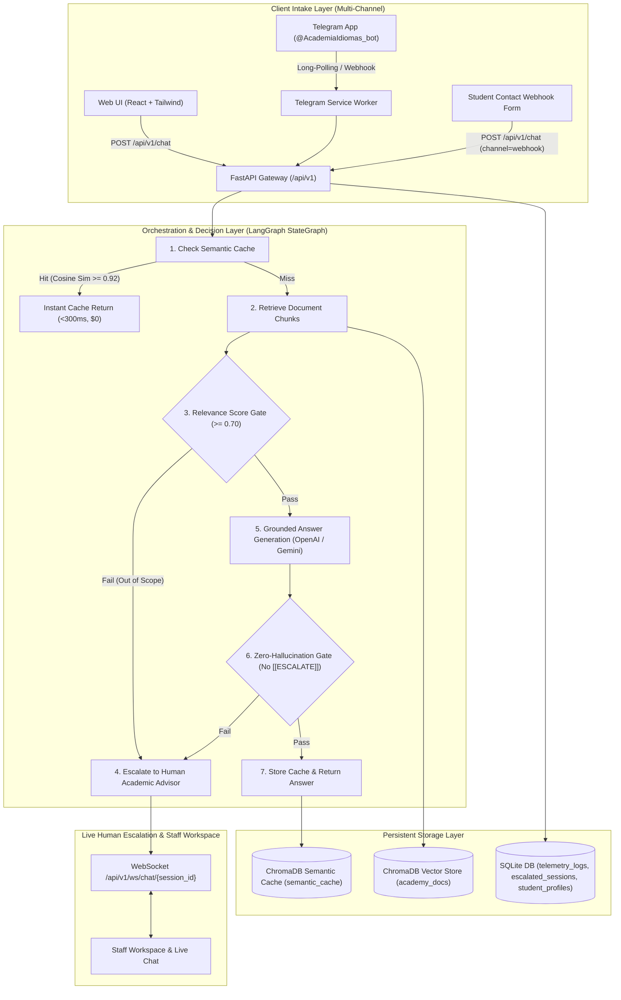

# Colombian Language Academy Intelligent Assistant (RAG & Human Escalation Pipeline)

[](https://fastapi.tiangolo.com)
[](https://github.com/langchain-ai/langgraph)
[](https://www.trychroma.com/)
[](https://react.dev/)
[](https://tailwindcss.com/)
[](LICENSE)

An enterprise-grade, zero-hallucination **Colombian Language Academy Intelligent Customer Service Assistant** powered by **FastAPI**, **LangGraph**, **ChromaDB**, and **SQLite**. Designed to automate repetitive customer service inquiries for a Colombian language academy across multiple channels (**Telegram Bot**, **Web Single-Page App**, and **HTTP Contact Form Webhook**), resolving questions regarding schedules, pricing, levels (CEFR), enrollment, certifications, and study modalities while guaranteeing strict grounding, sub-second semantic caching, real-time WebSocket human escalation, and operational telemetry.

---

## 🏛️ System Architecture Topology



---

## ✨ Key Capabilities

1. **Zero-Hallucination Guardrails & Grounded Answers**:
   - Strict citation requirements referencing official academy business documents (`cursos_y_modalidades.md`, `precios_y_metodos_de_pago.md`, `inscripciones_y_certificaciones.md`).
   - If an inquiry is out-of-scope or unverified, the LLM emits an `[[ESCALATE]]` token, routing the student to the Academic Advisory Team.
2. **Sub-Second Semantic Caching**:
   - Persists query-response embeddings into a dedicated ChromaDB collection.
   - Paraphrased and repeated inquiries are resolved in `<300ms` with **$0 USD LLM token cost**.
3. **Multi-Channel Support**:
   - **Web Chat UI**: Interactive chat interface with quick action chips and source citation drawer.
   - **Telegram Bot**: Long-polling worker or webhook mode for Telegram users.
   - **HTTP Contact Form Webhook**: Directly ingest website contact queries.
4. **Human-in-the-Loop Escalation**:
   - Real-time escalation protocol generating deterministic session IDs (`[Name]_[Last4Digits]`).
   - Bi-directional WebSockets for live chat handover between student and advisor.
5. **Operational Telemetry & Metrics**:
   - Protected `/api/v1/metrics` endpoint providing total query counts, cache hit ratios, escalation rates, token usage, and latency metrics.

---

## 📁 Repository Structure

```text
.
├── backend/
│   ├── app/
│   │   ├── api/             # FastAPI routers (chat, telegram, metrics, escalations, ws)
│   │   ├── core/            # Configuration (BaseSettings), prompt templates
│   │   ├── db/              # Async SQLAlchemy engine and session factory
│   │   ├── models/          # Relational entities (telemetry, escalations, students)
│   │   ├── schemas/         # Pydantic v2 DTOs
│   │   └── services/        # LangGraph workflow, vector store, cache, LLM factory
│   ├── data/
│   │   ├── raw/             # Official business markdown documents
│   │   └── chroma_db/       # ChromaDB persistent vector database
│   ├── scripts/             # Data generator, ingestion, and startup scripts
│   ├── tests/               # Unit, integration, and API test suites
│   ├── Dockerfile           # Multi-stage production container
│   └── requirements.txt     # Python dependencies
├── frontend/
│   ├── src/
│   │   ├── components/      # React UI components (Chat, Form, LiveAdvisor, Metrics)
│   │   ├── services/        # Axios API client
│   │   └── App.jsx
│   ├── package.json
│   └── vite.config.js
├── docs/                    # Architecture, API, Database, Rules, and ADR specs
├── documentation/           # Daily changelogs and phase technical documentation
├── docker-compose.yml       # Container orchestration specification
└── README.md
```

---

## 🚀 Quick Start (Local Setup)

### 1. Prerequisites
* Python 3.11+ (or `uv`)
* Node.js 18+ and `pnpm`
* Git

### 2. Environment Configuration
Copy environment templates and set your API keys:
```bash
cp backend/.env.example backend/.env
cp frontend/.env.example frontend/.env
```

### 3. Backend Setup
```bash
cd backend
python -m venv .venv
source .venv/bin/activate  # Or .venv\Scripts\activate on Windows
pip install -r requirements.txt

# Generate official academy business documents and ingest vectors
python scripts/generate_academy_data.py
python scripts/ingest.py

# Launch FastAPI development server
uvicorn app.main:app --reload --port 8000
```

### 4. Frontend Setup
```bash
cd ../frontend
pnpm install
pnpm dev
```
Open `http://localhost:5173` to interact with the web assistant.

---

## 🐳 Docker Deployment

```bash
docker-compose up --build
```
The application will automatically initialize the vector store, load the business knowledge base, and start the FastAPI gateway on port `8000`.

---

## 🧪 Running Automated Tests

```bash
cd backend
pytest tests/ -v
```
