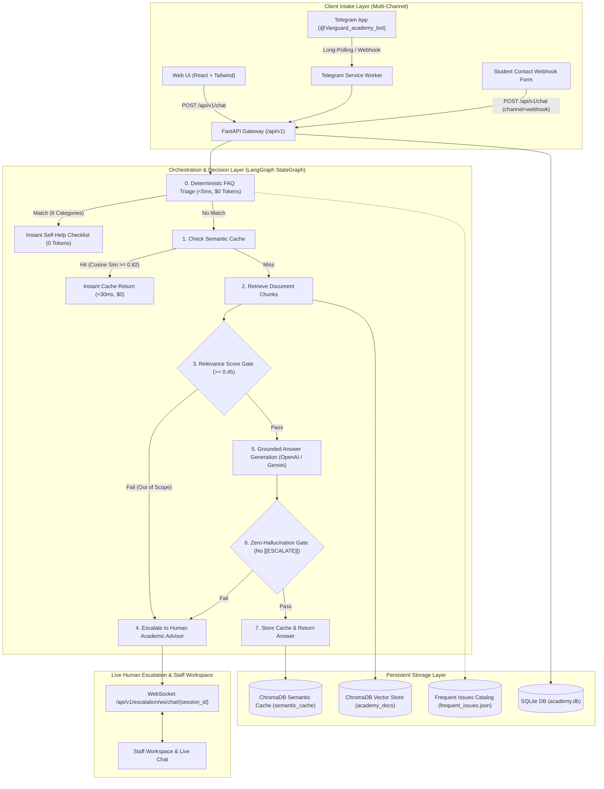

# Colombian Language Academy Intelligent Assistant (RAG & Human Escalation Pipeline)

[](https://fastapi.tiangolo.com)
[](https://github.com/langchain-ai/langgraph)
[](https://www.trychroma.com/)
[](https://react.dev/)
[](https://tailwindcss.com/)
[](LICENSE)

An enterprise-grade, zero-hallucination **Colombian Language Academy Intelligent Customer Service Assistant** powered by **FastAPI**, **LangGraph**, **ChromaDB**, and **SQLite**. Built to resolve the repetitive customer inquiries that saturate a Colombian language academy across three channels (**Web Chat SPA**, **Telegram Bot**, and **HTTP Contact Form Webhook**). The assistant resolves inquiries regarding course schedules, pricing in COP, CEFR levels, registration, international certifications, and modalities while guaranteeing strict document grounding, sub-second semantic caching, real-time WebSocket human escalation, and operational telemetry.

---

## 🏛️ System Architecture Topology



---

## ✨ Key Capabilities

1. **Dynamic Multi-LLM Provider Switching & Groq LPU Integration (ADR-016)**:
   - Administrators can seamlessly switch between **Groq LPU** (`llama-3.3-70b-versatile`), **Google Gemini** (`gemini-2.5-flash`), and **OpenAI** (`gpt-4o-mini`) directly from the Admin Portal in real time without restarting the application.
   - Custom API keys can be supplied per provider with secure masking and runtime database persistence.
2. **Encrypted Admin Authentication & JWT Bearer Sessions**:
   - SQLite `admin_users` table with **bcrypt** password hashing.
   - Secure access tokens issued via **JSON Web Tokens (JWT)** for protected endpoints (`/api/v1/metrics`, `/api/v1/settings/providers`, `/api/v1/conversations`).
   - Default administrative credentials auto-seeded on initialization: `admin` / `admin12345`.
3. **Vanguard Academy UI/UX Revolution (`ui-ux-pro-max`)**:
   - **Hero WebGL GhostCursor**: Fluid 3D particle trail built with Three.js.
   - **Editorial Landing Page**: Official CEFR programs, Bogotá & Medellín campuses, COP pricing tables, and free placement test CTA.
   - **Perplexity-style AI Assistant**: Citations pill cards, verification badges, collapsible search history, and instant question chips.
   - **No Human Advisor Contact Leaks**: Inquiries are strictly guided through the zero-hallucination AI Assistant.
4. **Visitor Conversation History & Auditing**:
   - Automated persistence of visitor sessions and messages in `chat_session_records` and `chat_message_records` for full compliance and inspection.
5. **Supervisor-Resilient Telegram Bot Worker**:
   - Robust long-polling worker with periodic client recycling and exponential backoff retry.
   - Self-healing supervisor loop in `run.sh` ensuring 24/7 uninterrupted uptime in cloud container deployments (Railway).
6. **Zero-Token Deterministic Triage Engine (ADR-012)**:
   - Returns structured self-help diagnostic checklists in **$< 5\text{ ms}$** consuming **$0\text{ tokens}$** at **$\$0.0\text{ USD}$ cost**.
7. **Zero-Hallucination Guardrails & Closed-Catalog Negation (ADR-011)**:
   - Strict citation referencing the 3 official academy documents (`cursos_y_modalidades.md`, `precios_y_metodos_de_pago.md`, `inscripciones_y_certificaciones.md`).

---

## 🚀 Quick Start (Local Setup)

### 1. Prerequisites
* Python 3.11+ (or Python 3.14 via `uv`)
* Node.js 18+ and `pnpm` (or `npm`)
* Git

### 2. Environment Configuration
Copy environment templates and set your API keys:
```bash
cp backend/.env.example backend/.env
cp frontend/.env.example frontend/.env
```

### 3. Backend Setup
```bash
cd backend
python3 -m venv .venv
source .venv/bin/activate  # Or .venv\Scripts\activate on Windows
pip install -r requirements.txt

# Ingest official academy documents
python scripts/generate_academy_data.py
python scripts/ingest.py

# Launch FastAPI development server
uvicorn app.main:app --reload --port 8000
```
* **API Documentation:** `http://localhost:8000/api/v1/docs`
* **Default Admin Login:** Username: `admin` | Password: `admin12345`

### 4. Standalone Resilient Telegram Bot Worker (Optional)
If running Telegram locally without webhooks:
```bash
python backend/scripts/telegram_worker.py
```

### 5. Frontend Setup
```bash
cd frontend
pnpm install
pnpm dev
```
Open `http://localhost:5173` to experience the Vanguard Language Academy platform.

---

## 🐳 Docker Deployment

To launch the entire stack in isolated production containers:
```bash
docker compose up --build -d
```
* **Frontend Web Application:** `http://localhost:3000`
* **Backend REST API:** `http://localhost:8000/api/v1/docs`
* **Healthcheck:** `http://localhost:8000/health`

---

## 🚂 Railway Cloud Deployment (Container Free/Starter Tier)

This repository is optimized for deployment on **Railway** using OCI containers without cloud vendor lock-in.

### 1. Deploying the Backend Service
1. Connect your repository to **Railway** (or use `railway init`).
2. Add a service from repo root pointing to directory `/backend` (Railway auto-detects [backend/railway.toml](file:///home/Coder/Documentos/DanielE/prueba_desempenio_ai_daniel_e/backend/railway.toml) and [backend/Dockerfile](file:///home/Coder/Documentos/DanielE/prueba_desempenio_ai_daniel_e/backend/Dockerfile)).
3. Configure Environment Variables in the Railway Dashboard:
   * `LLM_PROVIDER`: `gemini`
   * `GEMINI_API_KEY`: Your Google AI Studio API key
   * `ADMIN_API_KEY`: A strong administrative key
   * `TELEGRAM_BOT_TOKEN`: (Optional) Telegram bot token
4. Mount a Persistent Volume on path `/app/data` to persist `academy.db` and `chroma_db`.
5. Generate a public Railway domain (e.g. `https://academy-backend.up.railway.app`).

### 2. Deploying the Frontend Service
1. Add a second service from repo root pointing to directory `/frontend` (uses [frontend/railway.toml](file:///home/Coder/Documentos/DanielE/prueba_desempenio_ai_daniel_e/frontend/railway.toml) and [frontend/Dockerfile](file:///home/Coder/Documentos/DanielE/prueba_desempenio_ai_daniel_e/frontend/Dockerfile)).
2. Set Environment Variable:
   * `VITE_API_URL`: Your deployed backend API URL (e.g. `https://academy-backend.up.railway.app/api/v1`).
3. Generate a public domain to access the web application.

---

## 🧪 Running Automated Tests

The test suite includes offline deterministic mock embeddings (`DeterministicMockEmbeddings`), requiring no live API keys to execute:
```bash
cd backend
pytest tests/ -v
```
To run unit and integration suites separately:
```bash
pytest tests/unit/ -v
pytest tests/integration/ -v
```
